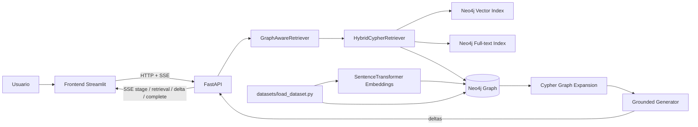
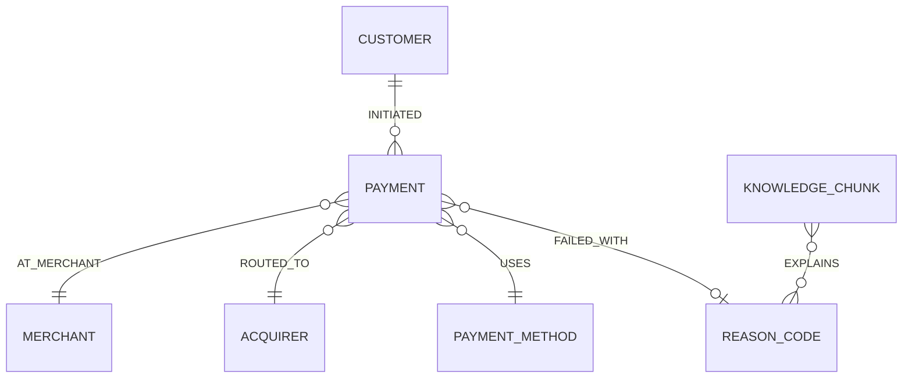

# Axiz GraphRAG Payments PoC

Versión de la PoC: **1.7.0** (GraphRAG conversacional con GraphSAGE automático y referencia por conversación).

PoC técnica en Python para demostrar una arquitectura **GraphRAG (Graph Retrieval-Augmented Generation)** sobre un caso funcional de **payment processing**: investigación de rechazos, timeouts y controles operativos de pagos.

Además de la recuperación híbrida, esta versión incorpora entrenamiento real de **GraphSAGE en Neo4j GDS**, embeddings de pagos persistidos y recuperación neuronal opcional para GraphRAG.

El foco no es construir un procesador de pagos completo. El objetivo es probar, de extremo a extremo, que una consulta en lenguaje natural puede:

1. recuperar conocimiento por similitud semántica;
2. combinar esa recuperación con búsqueda lexical;
3. usar el resultado como punto de entrada a un **grafo de conocimiento**;
4. recorrer relaciones para incorporar pagos, códigos de rechazo, comercios y adquirentes conectados;
5. generar una respuesta sustentada en ese contexto y exponer trazabilidad de lo recuperado.

La PoC usa únicamente la infraestructura necesaria para probar el concepto: **Neo4j**. No agrega PostgreSQL, Redis, Kafka ni un vector database separado porque Neo4j ya cubre grafo, full-text y vector search para este escenario.

---

## 1. Caso de uso tecnológico

Un RAG vectorial tradicional puede encontrar un texto que explique el código `05`, pero no conoce por sí mismo qué pagos de la muestra están conectados con ese código, en qué comercio ocurrieron o por qué adquirente fueron ruteados.

GraphRAG agrega esa segunda dimensión: después de encontrar los `KnowledgeChunk` relevantes, la consulta recorre el grafo:

`KnowledgeChunk -> ReasonCode <- Payment -> Merchant / Acquirer`

La PoC usa `HybridCypherRetriever` del paquete oficial `neo4j-graphrag` para combinar:

- **vector retrieval** sobre embeddings multilingües;
- **full-text retrieval** para coincidencias lexicales como `05`, `91`, `3DS`, etc.;
- **Cypher graph expansion** para recuperar entidades relacionadas;
- **exact entity anchoring** para códigos explícitos: una pregunta por `código 91` ancla primero el `ReasonCode 91` antes de completar el contexto con el ranking híbrido.

La documentación oficial de Neo4j describe `HybridCypherRetriever` precisamente como un retriever que busca por vector + full-text y luego ejecuta una consulta Cypher para recorrer más contexto del grafo.

### Características técnicas probadas

| Capacidad | Cómo se demuestra |
|---|---|
| Vector search | Índice `knowledge_embedding` en `KnowledgeChunk.embedding` |
| Full-text search | Índice `knowledge_fulltext` sobre `KnowledgeChunk.search_text` |
| Retrieval híbrido | `HybridCypherRetriever` combina ambos índices con ranker `linear`, peso vectorial configurable y un candidate pool ampliado |
| Exact reason-code anchoring | Si la pregunta nombra explícitamente `código 05/51/91/...`, Neo4j recupera primero los chunks conectados exactamente a ese `ReasonCode` y luego completa con retrieval híbrido |
| Graph traversal | Cypher expande desde conocimiento a códigos y pagos relacionados |
| Grounding | La respuesta se arma exclusivamente con contextos recuperados |
| Trazabilidad | API devuelve retriever, índices, expansión, ranking y contextos |
| Streaming reactivo | SSE (`text/event-stream`) emite etapas de retrieval, deltas del LLM y evento final |
| Ejecución sin credenciales externas | `GENERATION_PROVIDER=deterministic` por defecto |
| Generación con LLM real | Opcional con `GENERATION_PROVIDER=openai` y `OPENAI_API_KEY` |

> La generación determinística es deliberada para que la PoC funcione completamente sin credenciales externas. El retrieval —que es el núcleo del caso de uso GraphRAG— sí utiliza el stack real de Neo4j GraphRAG. Si se configura OpenAI, la capa de generación cambia a un LLM manteniendo exactamente el mismo contexto recuperado.

---

## 2. Caso de uso funcional: investigación de payment processing

El dataset original contiene **24 pagos**, **5 comercios**, **2 adquirentes** y **15 chunks de conocimiento**. La carga agrega por defecto **320 pagos ficticios reproducibles** para ejercitar GraphSAGE (`SYNTHETIC_PAYMENT_COUNT=0` desactiva la ampliación). Incluye aprobaciones, rechazos, fallas técnicas, controles antifraude y estados operativos como:

- `05`: do not honor;
- `51`: fondos insuficientes;
- `91`: emisor/switch no disponible;
- `3DS_TIMEOUT`: timeout durante autenticación;
- `DUPLICATE_RISK`: riesgo de duplicidad por retry sin idempotencia;
- `54`, `57`, `61`, `96`: expiración, operación no permitida, límite de monto y falla técnica;
- `FRAUD_VELOCITY`: bloqueo por reglas de velocity;
- `CAPTURE_FAILED`: captura fallida luego de autorización;
- `WEBHOOK_DELAY`: evento tardío / consistencia eventual;
- `REFUND_PENDING`: reembolso pendiente;
- `TOKENIZATION_ERROR`: falla de tokenización.

Ejemplo de pregunta:

```text
¿Por qué se rechazan pagos con código 05 y qué debería revisar operaciones?
```

La PoC recupera el conocimiento que explica el código y expande el grafo hacia los pagos conectados, mostrando comercio, adquirente, monto y estado como evidencia adicional.

---

## 3. Arquitectura



### Por qué no se agregan más componentes

- **No PostgreSQL**: los datos necesarios para la prueba viven naturalmente como nodos/relaciones.
- **No Redis**: no se prueba caching ni session state distribuido.
- **No Kafka/RabbitMQ**: el streaming requerido es de respuesta HTTP y se implementa directamente con **SSE**; no existe un caso que justifique un broker.
- **No Pinecone/Qdrant/Weaviate**: Neo4j ya provee el índice vectorial requerido.
- **No Flyway**: Flyway está orientado a migraciones SQL. Para Neo4j esta PoC usa DDL Cypher idempotente (`CREATE ... IF NOT EXISTS`) dentro del cargador de datasets, evitando duplicar scripts de inicialización.

---

## 4. Estructura del proyecto

```text
.
├── datasets/                  # Datos de ejemplo y cargador idempotente del grafo
│   ├── data/
│   └── load_dataset.py
├── frontend/                  # UI conversacional Streamlit estilo ChatGPT con identidad visual Axiz
│   ├── .streamlit/config.toml  # Tema oscuro y tokens visuales de Streamlit
│   ├── assets/                 # Logo, ícono del agente y favicon del frontend de referencia
│   ├── api_client.py
│   ├── ui_helpers.py
│   └── app.py
├── infrastructure/            # Docker Compose, Dockerfiles y ejemplos request/response
│   ├── requests/
│   ├── responses/
│   ├── app.Dockerfile          # Imagen backend compartida por API y dataset-loader
│   ├── frontend.Dockerfile
│   └── docker-compose.yml
├── src/pe/axiz/graphrag_payments/
│   ├── api/                   # Endpoints FastAPI
│   ├── application/           # Retrieval, generación y orquestación GraphRAG
│   ├── domain/                # Contratos Pydantic
│   ├── infrastructure/        # Acceso a Neo4j
│   ├── main.py
│   └── settings.py
├── tests/                     # Pruebas unitarias
├── pyproject.toml
└── README.md                  # Único documento del proyecto
```

El paquete principal cumple el namespace solicitado: **`pe.axiz`**.

---

## 5. Código principal

### `application/retrieval.py`

Implementa el núcleo tecnológico. Usa `SentenceTransformerEmbeddings` y `HybridCypherRetriever`. El retriever identifica `KnowledgeChunk` relevantes y luego ejecuta una expansión Cypher. Cuando la pregunta contiene un código explícito (`código 91`, por ejemplo), primero ejecuta un **anclaje exacto por entidad** sobre `ReasonCode` para impedir que la similitud semántica sustituya el código consultado por otro cercano. Después completa los resultados con `HybridCypherRetriever`. La expansión agrega:

- `ReasonCode` explicados por el chunk;
- `Payment` que fallaron con esos códigos;
- `Merchant` de esos pagos;
- `Acquirer` por el que fueron ruteados.

### `application/generation.py`

Abstrae la etapa de generación:

- `DeterministicGroundedGenerator`: modo por defecto, reproducible y sin API key;
- `OpenAIGroundedGenerator`: opcional, usa un LLM y recibe exactamente el mismo contexto GraphRAG.

### `application/service.py`

Orquesta retrieval + generación y expone metadatos de trazabilidad. También permite consultar el subgrafo de un pago específico.

### `datasets/load_dataset.py`

Es el único mecanismo de inicialización de datos/esquema. Es idempotente y crea:

- constraints;
- índice vectorial;
- índice full-text;
- conocimiento operativo con embeddings;
- pagos y relaciones.

No hay scripts de seed duplicados en `infrastructure/`.

---

## 6. Tecnologías y versiones

La PoC apunta a **Python 3.13**. Las dependencias directas se fijan para hacer la ejecución reproducible y fueron seleccionadas sobre versiones estables actuales al 18-09-2026:

| Tecnología | Versión |
|---|---:|
| Python | 3.13 |
| Neo4j Community | 2026.08.1 |
| neo4j-graphrag | 1.19.0 |
| neo4j Python driver | 6.3.1 |
| sentence-transformers | 3.4.1 (última versión compatible con GraphRAG 1.19.0) |
| FastAPI | 0.141.1 |
| Uvicorn | 0.53.0 |
| Pydantic | 2.13.5 |
| pydantic-settings | 2.15.0 |
| OpenAI Python SDK | 1.109.1 (última versión compatible con GraphRAG 1.19.0) |
| Streamlit | 1.64.0 |
| HTTPX | 0.28.1 |
| pytest | 9.1.1 |
| Ruff | 0.16.8 |

`neo4j-graphrag 1.19.0` soporta Python 3.13 y declara `neo4j >=5.28.4,<7`, `pydantic >=2.6.3,<3`, `sentence-transformers >=3,<4` y `openai >=1.51.1,<2`. Por eso se usan `sentence-transformers 3.4.1` y `openai 1.109.1`: son las últimas versiones de sus respectivas ramas que permanecen dentro de los rangos soportados por GraphRAG 1.19.0. No se usan las versiones absolutas más nuevas 6.x/3.x porque romperían la resolución de dependencias.

---

## 7. Modelo de grafo



El índice vectorial y full-text se aplican a `KnowledgeChunk`; la evidencia transaccional se obtiene navegando relaciones, no duplicándola dentro del texto embebido.

---

## 8. Endpoints en orden de ejecución

| Orden | Método | Endpoint | Descripción funcional | Descripción técnica |
|---:|---|---|---|---|
| 1 | GET | `/health/live` | Verifica que el proceso API esté vivo | No toca dependencias externas |
| 2 | GET | `/health/ready` | Verifica que el servicio esté listo | Ejecuta una consulta mínima a Neo4j |
| 3 | GET | `/api/v1/graph/schema` | Permite inspeccionar el modelo cargado | Devuelve labels, relationship types e índices de Neo4j |
| 4 | GET | `/api/v1/payments/{payment_id}/graph` | Inspecciona el vecindario de un pago | Recupera nodos/relaciones conectados al payment |
| 5 | POST | `/api/v1/graphrag/query` | Responde una pregunta operativa de forma síncrona | Hybrid retrieval + graph expansion + grounded generation |
| 6 | POST | `/api/v1/graphrag/query/stream` | Responde progresivamente para la UI | SSE: `stage` → `retrieval` → `delta` → `complete` |

Swagger/OpenAPI queda disponible en `http://localhost:8000/docs`.

---

## 9. Levantar infraestructura y aplicación

### Prerrequisitos

- Docker Desktop / Docker Engine con Docker Compose v2.
- Aproximadamente 2–3 GB libres para imágenes, dependencias ML CPU y modelo de embeddings.
- La primera ejecución necesita acceso a Internet para descargar la imagen de Neo4j, dependencias Python y el modelo de Sentence Transformers.
- Para ejecución local fuera de Docker se recomienda `uv`; Docker Compose no lo requiere.

Desde la raíz del proyecto:

```bash
cp .env.example .env
```

Luego:

```bash
docker compose -f infrastructure/docker-compose.yml up --build

docker compose --env-file .env -f infrastructure/docker-compose.yml up --build --no-deps
```

La construcción está optimizada para evitar duplicar trabajo pesado:

- `api` y `dataset-loader` usan **la misma imagen backend** (`axiz-graphrag-payments-poc-app:1.5.5`) construida desde `infrastructure/app.Dockerfile`;
- PyTorch se instala desde el índice oficial **CPU-only**, porque esta PoC no requiere CUDA/GPU;
- las dependencias se instalan antes de copiar el código de aplicación, por lo que cambios normales en `src/` reutilizan las capas pesadas del build;
- el modelo de embeddings se almacena en un volumen `hf_cache` compartido entre `dataset-loader` y `api`, evitando descargarlo dos veces;
- el frontend instala únicamente Streamlit/HTTPX y no arrastra las dependencias de GraphRAG; además sus dependencias se cachean antes de copiar el código de UI.
- la interfaz adopta la construcción visual del proyecto de referencia suministrado: tema oscuro Axiz, logo e ícono empaquetados y superficie conversacional central inspirada en ChatGPT;
- el **sidebar izquierdo es propio de la aplicación**, conserva nuevo chat, búsqueda, historial agrupado, selección, renombrado y eliminación de conversaciones y puede colapsarse como en ChatGPT; al ocultarlo desaparece realmente y el chat central gana un ancho moderado; también muestra el estado de API/Neo4j y las capacidades de recuperación activas;
- el **sidebar derecho** queda reservado para configuración de la PoC: `Top K`, actividad técnica, evidencia recuperada, progreso de consulta y limpieza de la conversación actual;
- el documento principal se mantiene **sin scroll en desktop**: los sidecards izquierdo/derecho quedan anclados al viewport y solo el historial central de chat tiene scroll; el scroll usa comportamiento nativo (`scroll-behavior: auto`) para evitar sensación de lentitud en mouse/trackpad;
- el historial central usa **un único viewport propio (`.st-key-chat_scroll_panel`) con `overflow-y:auto`** y altura explícita (`--axiz-chat-h`, con respaldo `calc(100dvh - CHAT_RESERVED_PX)`); los wrappers de Streamlit entre el viewport y el hilo (`chat_thread`) se fuerzan a tamaño de contenido para que el desborde sea siempre scrolleable. Un driver JS (vía `st.html(..., unsafe_allow_javascript=True)` o, si no existe, `st.iframe`) sigue el streaming mientras el usuario está al final, se suelta al primer scroll hacia arriba, se rearma con cada pregunta y ajusta la altura del viewport al composer real; si el JS no pudiera ejecutarse, un ancla CSS (`overflow-anchor`) mantiene el seguimiento una vez que el usuario está al final;
- `st.chat_input` se renderiza **inline dentro de la columna central**, evitando el footer global de Streamlit que antes podía desplazar o recortar los paneles laterales;
- al comenzar el primer turno, la superficie de bienvenida se oculta inmediatamente mediante un marcador de streaming; esto evita que “¿Qué quieres investigar sobre tus pagos?” permanezca visible debajo de los primeros deltas mientras Streamlit termina de podar el DOM del render anterior;
- el frontend consume `/api/v1/graphrag/query/stream` y pinta la respuesta progresivamente; los deltas SSE pequeños se agrupan en lotes cortos antes de renderizarse para reducir repaints y mantener fluido el scroll sin perder la sensación de streaming;
- el chat mantiene un ancho de lectura contenido (aprox. 940 px con navegación abierta y 1040 px cuando se colapsa), evitando estirar las respuestas por toda la pantalla;
- el panel izquierdo muestra el **proveedor de generación realmente reportado por `api-1`** (`OpenAI · modelo` o `Deterministic`), evitando confundir la configuración de un contenedor temporal con la del API activo;
- se mantienen las cuatro preguntas sugeridas en el estado inicial, con separación propia para evitar solapamientos visuales, y el input inferior fijo;
- el historial de UI permanece deliberadamente en `st.session_state`: no se agrega una base de datos solo para conversaciones porque no es necesaria para demostrar GraphRAG.

En el primer `--build` todavía se descargarán Python, PyTorch CPU, GraphRAG y Sentence Transformers, por lo que puede tardar varios minutos según la conexión. En rebuilds posteriores, Docker reutiliza las capas si `pyproject.toml` no cambió.

El flujo de arranque es deliberadamente secuencial:

1. `neo4j` inicia;
2. `dataset-loader` espera a Neo4j, crea constraints/índices y carga datos + embeddings;
3. `api` inicia cuando el dataset terminó correctamente;
4. `frontend` inicia cuando la API está saludable.


### 9.1 Qué esperar del primer build

La primera ejecución es la más costosa porque debe descargar las imágenes base y las dependencias ML. Para ver el detalle del progreso:

```bash
docker compose -f infrastructure/docker-compose.yml build --progress=plain
```

Luego levante los servicios sin reconstruir:

```bash
docker compose -f infrastructure/docker-compose.yml up
```

Para comprobar que Docker está reutilizando caché en una reconstrucción, las etapas de instalación de PyTorch/dependencias deberían aparecer como `CACHED` mientras `pyproject.toml` permanezca sin cambios.

Servicios:

- Frontend: `http://localhost:8501`
- API: `http://localhost:8000`
- Swagger: `http://localhost:8000/docs`
- Neo4j Browser: `http://localhost:7474`

Credenciales Neo4j por defecto:

```text
usuario: neo4j
password: axiz-graphrag-poc
```

Para detener:

```bash
docker compose -f infrastructure/docker-compose.yml down
```

Para detener y borrar el volumen Neo4j:

```bash
docker compose -f infrastructure/docker-compose.yml down -v
```

---

## 10. Carga del dataset

Normalmente no hay que ejecutar nada manual: `dataset-loader` se ejecuta automáticamente por Compose.

Si se quiere recargar manualmente desde el host, con Neo4j ya levantado:

```bash
uv sync --extra dev --extra ui
uv run python datasets/load_dataset.py
```

El script es idempotente: usa `MERGE` para nodos/relaciones y `CREATE ... IF NOT EXISTS` para schema/indexes. Si se actualiza desde una versión anterior con un dataset diferente, vuelva a ejecutar el `dataset-loader` para sincronizar nodos y embeddings.

Archivos precargados:

- `datasets/data/knowledge.json`: conocimiento operacional usado para retrieval;
- `datasets/data/payments.json`: pagos, comercios, adquirentes, métodos y códigos relacionados.

---

## 11. Ejecutar el proyecto sin Docker para API/frontend

Puede usarse Neo4j en Docker y ejecutar API/UI desde el IDE.

### 11.1 Dependencias

```bash
uv sync --extra dev --extra ui
```

### 11.2 Neo4j

```bash
docker compose -f infrastructure/docker-compose.yml up -d neo4j
```

### 11.3 Variables locales

En el host, ajuste `.env` para apuntar a:

```dotenv
NEO4J_URI=neo4j://localhost:7687
```

### 11.4 Dataset

```bash
uv run python datasets/load_dataset.py
```

### 11.5 API

```bash
uv run uvicorn pe.axiz.graphrag_payments.main:app --reload --port 8000
```

### 11.6 Frontend

En otra terminal:

```bash
cd frontend
API_BASE_URL=http://localhost:8000 uv run streamlit run app.py
```

---

## 12. Probar por `curl`

### Test 1 — liveness

Comprueba que FastAPI está ejecutándose; no valida Neo4j.

```bash
curl -s http://localhost:8000/health/live
```

Esperado:

```json
{"status":"ok"}
```

### Test 2 — readiness

Comprueba que la API realmente puede consultar Neo4j.

```bash
curl -s http://localhost:8000/health/ready
```

Esperado cuando OpenAI está activo:

```json
{"status":"ready","neo4j":"reachable","generation_provider":"openai","generation_model":"gpt-5-mini","openai_key_configured":true}
```

Este endpoint permite verificar la configuración del **API activo**, no la de un contenedor temporal.

### Test 3 — inspeccionar el schema del grafo

Permite validar que el dataset-loader creó labels, relaciones e índices.

```bash
curl -s http://localhost:8000/api/v1/graph/schema
```

Debe incluir, entre otros, `Payment`, `KnowledgeChunk`, `ReasonCode`, `knowledge_embedding` y `knowledge_fulltext`.

### Test 4 — ver el subgrafo de un pago

Valida relaciones reales alrededor de una transacción fallida.

```bash
curl -s http://localhost:8000/api/v1/payments/PAY-1003/graph
```

Debe recuperar el `Payment` y sus vecinos: customer, merchant, acquirer, method y reason code.

### Test 5 — GraphRAG por código de rechazo

Este es el test principal. Demuestra búsqueda semántica + lexical + expansión de grafo.

```bash
curl -s -X POST http://localhost:8000/api/v1/graphrag/query \
  -H 'Content-Type: application/json' \
  -d @infrastructure/requests/01-graphrag-query.json
```

Revise en la respuesta:

- `answer`: respuesta sustentada;
- `contexts`: chunks recuperados;
- `reason_codes`: entidades conectadas;
- `related_payments`: evidencia transaccional obtenida recorriendo el grafo;
- `trace.retriever`: debe ser `HybridCypherRetriever`;
- `trace.graph_expansion`: muestra el recorrido aplicado.

Para validar el anclaje exacto por código:

```bash
curl -s -X POST http://localhost:8000/api/v1/graphrag/query \
  -H 'Content-Type: application/json' \
  -d '{"question":"¿Para qué sirve el código 91?","top_k":4,"include_context":true}'
```

El primer contexto debe corresponder al código `91`; en `trace.retrieval_strategy` debe aparecer `exact_reason_code_anchor+hybrid` y `trace.explicit_reason_codes` debe contener `91`.

### Test 6 — consulta semántica sin citar un código

Demuestra que el retrieval no depende únicamente de keywords exactas.

```bash
curl -s -X POST http://localhost:8000/api/v1/graphrag/query \
  -H 'Content-Type: application/json' \
  -d '{
    "question":"Veo fallas temporales de conectividad con el emisor. ¿Qué debería correlacionar y qué pagos de ejemplo existen?",
    "top_k":4,
    "include_context":true
  }'
```

Se espera recuperar conocimiento asociado a indisponibilidad (`91`) y/o ruteo/latencia, junto con pagos relacionados por el grafo.

### Test 7 — idempotencia

Demuestra que la misma arquitectura puede recuperar conocimiento de un control técnico que no depende de un rechazo ISO tradicional.

```bash
curl -s -X POST http://localhost:8000/api/v1/graphrag/query \
  -H 'Content-Type: application/json' \
  -d '{
    "question":"¿Cómo evito cobros duplicados cuando el cliente reintenta por un timeout?",
    "top_k":4,
    "include_context":true
  }'
```

### Test 8 — streaming SSE

Demuestra el flujo reactivo que consume el frontend. `curl -N` desactiva el buffering de salida para ver los eventos a medida que llegan.

```bash
curl -N -X POST http://localhost:8000/api/v1/graphrag/query/stream \
  -H 'Accept: text/event-stream' \
  -H 'Content-Type: application/json' \
  -d '{
    "question":"¿Cómo evito cobros duplicados cuando el cliente reintenta por un timeout?",
    "top_k":4,
    "include_context":true
  }'
```

La secuencia esperada es: `event: stage`, `event: retrieval`, múltiples `event: delta` y finalmente `event: complete`.

### Otras preguntas útiles para probar el corpus

- `¿Qué significa el código 54 y debo reintentar con la misma tarjeta?`
- `¿Qué diferencia hay entre fondos insuficientes (51) y exceder el límite (61)?`
- `¿Qué debería revisar si recibo código 96 en una ventana de pocos minutos?`
- `¿Por qué una autorización aprobada puede terminar con captura fallida?`
- `¿Cómo debería tratar webhooks tardíos sin crear un segundo pago?`
- `¿Qué evidencia hay de reglas de velocity o antifraude?`
- `¿Qué debo revisar ante errores de tokenización?`
- `¿Cómo manejar un reembolso que sigue pendiente?`
- `¿Cuándo tiene sentido hacer rerouting por adquirente?`
- `¿Qué diferencia hay entre un timeout 3DS y un código 91 del emisor?`

---

## 13. Activar generación con OpenAI

El modo por defecto es totalmente local/reproducible:

```dotenv
GENERATION_PROVIDER=deterministic
```

Para usar un LLM:

```dotenv
GENERATION_PROVIDER=openai
OPENAI_API_KEY=<su-api-key>
OPENAI_MODEL=gpt-5-mini
```

Después de modificar `.env`, **recree `api`**; `docker compose restart api` no cambia las variables con las que fue creado el contenedor:

```bash
docker compose --env-file .env -f infrastructure/docker-compose.yml up -d --no-deps --force-recreate api
```

Verifique el contenedor real que atiende tráfico:

```bash
docker compose -f infrastructure/docker-compose.yml exec api \
  python -c "import os; print(os.getenv('GENERATION_PROVIDER')); print(os.getenv('OPENAI_MODEL')); print(bool(os.getenv('OPENAI_API_KEY')))"
```

También puede consultar `/health/ready`; la UI muestra el mismo proveedor y modelo reportados por ese endpoint. No use el resultado de `docker compose run --rm api ...` como prueba del estado de `api-1`: ese comando crea un contenedor temporal con la configuración actual.

La etapa de retrieval no cambia: el LLM recibe únicamente el contexto GraphRAG ya recuperado.

---

## 14. Calidad de código y pruebas

Instalar entorno de desarrollo:

```bash
uv sync --extra dev --extra ui
```

Lint:

```bash
uv run ruff check src frontend datasets tests
```

Tests:

```bash
uv run pytest -q
```

Compilación sintáctica de todo el código Python:

```bash
uv run python -m compileall -q src frontend datasets tests
```

Build del paquete:

```bash
uv build
```

Estas verificaciones están pensadas para ejecutarse antes de modificar o integrar la PoC en un IDE.

---

## 15. Validación realizada antes del empaquetado

El entregable fue validado con Python 3.13 antes de generar el ZIP:

- compilación sintáctica de `src`, `frontend`, `datasets` y `tests`: **OK**;
- suite unitaria: **19/19 tests OK**;
- parsing de los JSON de datasets y ejemplos request/response: **OK**;
- parsing del `docker-compose.yml`: **OK**;
- consistencia referencial del dataset de ejemplo: **OK**;
- versiones directas de dependencias contrastadas con sus metadatos oficiales y con los rangos de compatibilidad de `neo4j-graphrag`;
- backend Docker consolidado para `api` + `dataset-loader`, con PyTorch CPU-only y capas reutilizables: **OK**.

El entorno utilizado para empaquetar no dispone de un daemon Docker, por lo que la ejecución end-to-end de los contenedores no pudo realizarse aquí. El `docker compose` queda preparado para realizar esa validación en cualquier equipo con Docker Engine/Desktop y acceso a Internet para la descarga inicial de imágenes y del modelo de embeddings.

---

## 16. Decisiones de diseño relevantes para una evolución productiva

Esta PoC aplica buenas prácticas pero no intenta disfrazarse de producto terminado. Para producción normalmente se agregarían, solo si el caso real lo requiere:

- autenticación/autorización;
- observabilidad centralizada;
- gestión de secretos;
- evaluación offline de retrieval y generación;
- controles de PII/PCI y tokenización;
- rate limiting;
- CI/CD;
- pruebas de carga;
- ingestión incremental/CDC;
- políticas de retención y versionado del conocimiento.

No se incluyen aquí porque no son necesarias para validar el concepto técnico GraphRAG.

---

## 17. Qué demuestra la PoC

La validación principal no es que un chatbot responda una pregunta, sino que el servicio pueda **usar una búsqueda semántica/lexical para localizar conocimiento y luego explotar las relaciones del grafo para obtener evidencia conectada que un RAG plano no tiene**.

Ese patrón es especialmente útil en payment processing porque las explicaciones operativas suelen estar conectadas con múltiples dimensiones: códigos de rechazo, adquirentes, comercios, medios de pago, intentos, timeouts y controles como idempotencia.


---

## 18. Referencias técnicas oficiales

- Neo4j GraphRAG for Python: https://neo4j.com/docs/neo4j-graphrag-python/current/
- Streamlit `st.iframe`: https://docs.streamlit.io/develop/api-reference/text/st.iframe
- Streamlit `st.write_stream`: https://docs.streamlit.io/develop/api-reference/write-magic/st.write_stream
- OpenAI Python streaming: https://github.com/openai/openai-python#streaming-responses
- Guía RAG y retrievers de Neo4j: https://neo4j.com/docs/neo4j-graphrag-python/current/user_guide_rag.html
- Neo4j Docker: https://neo4j.com/docs/operations-manual/current/docker/introduction/
- Paquete neo4j-graphrag 1.19.0: https://pypi.org/project/neo4j-graphrag/
- Sentence Transformers: https://pypi.org/project/sentence-transformers/


---

## 13. GraphSAGE: entrenamiento real y consultas neuronales (v1.6.0)

GraphSAGE aprende embeddings de nodos mediante agregación de vecinos en un grafo proyectado de
`Payment`, `Merchant`, `Acquirer` y `ReasonCode`. Los tipos de relaciones proyectados se tratan
como no dirigidos (`AT_MERCHANT`, `ROUTED_TO`, `FAILED_WITH`) para que los pagos incorporen señales
de su vecindario. Se crea una propiedad numérica de **10 dimensiones** (`sage_features`) con
indicadores de tipo de nodo, importe normalizado, estado del pago y categorías técnicas de códigos.
No se utilizan identificadores de cliente ni dígitos de tarjeta como atributos del modelo.

Se ejecutan los procedimientos GDS **`gds.graph.project` → `gds.beta.graphSage.train` →
`gds.beta.graphSage.write`**. El entrenamiento es no supervisado y utiliza embeddings de
**32 dimensiones** por defecto, dos capas de agregación (`sampleSizes: [10, 5]`), `mean`,
semilla 42 y 5 épocas. Los vectores se persisten en `Payment.sage_embedding`; el nombre del
modelo y metadatos se conservan en `GraphSageRun`. Los grafos y modelos del catálogo de GDS son
temporales y desaparecen tras reiniciar Neo4j; los vectores **sí** permanecen en la base.
Para reentrenar (p. ej. tras agregar nuevos pagos) ejecuta de nuevo el endpoint de entrenamiento.

**Ejecutar desde la raíz del repositorio:**

```bash
docker compose -f infrastructure/docker-compose.yml up -d --build
# Comprobar que el cargador finalizó y Neo4j esté listo:
docker compose -f infrastructure/docker-compose.yml ps
# Consultar el estado antes de entrenar:
curl -s http://localhost:8000/api/v1/graphsage/status
# Entrenar GraphSAGE desde FastAPI (puede tomar varios minutos en una máquina modesta):
curl -s -X POST http://localhost:8000/api/v1/graphsage/train \
  -H 'Content-Type: application/json' \
  --data @infrastructure/requests/04-graphsage-train.json
# Vecinos neuronales de un pago del dataset original:
curl -s 'http://localhost:8000/api/v1/graphsage/payments/PAY-1007/similar?top_k=5'
# Neural GraphRAG: añade al contexto los vecinos neuronales encontrados:
curl -s -X POST http://localhost:8000/api/v1/graphrag/query \
  -H 'Content-Type: application/json' \
  --data @infrastructure/requests/06-graphrag-neural.json
```

También puedes abrir `http://localhost:8501`, expandir **GraphSAGE · pagos similares** en la
barra lateral, entrenar y consultar un pago. El chat habitual permanece sin cambios; el modo
Neural GraphRAG se habilita expresamente enviando `neural_payment_id` en la petición REST o SSE.
La respuesta muestra vecinos y similitud coseno en `neural_neighbors`, un contexto con
`source=graphsage` y estadísticas en `trace.neural_matches`. Cuando la pregunta contiene un código
explícito, se conserva el anclaje exacto antes de insertar la evidencia neuronal.

### Contratos y fallos esperados

| Endpoint | Función |
|---|---|
| `GET /api/v1/graphsage/status` | Contabiliza pagos con embeddings y lee metadatos de entrenamiento. |
| `POST /api/v1/graphsage/train` | Prepara features, proyecta grafo, entrena, escribe embeddings y registra métricas. |
| `GET /api/v1/graphsage/payments/{payment_id}/similar?top_k=5&min_similarity=0.0` | Similitud coseno y evidencias de vecinos; 404 si el pago no existe y 409 si no hay embeddings. |
| `POST /api/v1/graphrag/query` con `neural_payment_id` | Añade los vecinos al contexto y explica su carácter de similitud, no de causalidad. |

El entrenamiento devuelve 503 cuando GDS no está disponible o el grafo de pagos está vacío.
Los JSON en `infrastructure/responses/04-*` y `05-*` son **solo ejemplos de contrato**, no
resultados de entrenamiento medidos. Los 24 pagos originales y los ejemplos sintéticos no
constituyen un conjunto de evaluación de fraude ni validan identificación de causas raíz. La
similitud coseno mide proximidad de embeddings, **no una probabilidad de incidente**.

En Docker Compose, `NEO4J_PLUGINS='["graph-data-science"]'` habilita GDS en el Neo4j existente,
sin nuevos servicios de base de datos. La primera inicialización requiere conectividad a los
repositorios de plugins y al modelo de embeddings de Sentence Transformers; el volumen
`neo4j_plugins` conserva el JAR descargado. El endpoint de entrenamiento no tiene autenticación:
**utiliza la PoC únicamente en un entorno local de desarrollo**; añade autorización si la expones.

Documentación oficial: [GraphSAGE](https://neo4j.com/docs/graph-data-science/current/machine-learning/node-embeddings/graph-sage/),
[GDS en Docker](https://neo4j.com/docs/graph-data-science/current/installation/installation-docker/).


## Historial v1.6.1: selector del chat y corrección de import (flujo antiguo)

La versión conserva el flujo GraphRAG original, los endpoints existentes y la consulta
GraphSAGE independiente de la barra lateral. Se corrige el import de
`Neo4jError` desde `neo4j.exceptions` (en el driver Neo4j 6.3.1, importar
`Neo4jError` directamente desde `neo4j` podía impedir el arranque de FastAPI).

En **Configuración → Modo de recuperación del chat**:

- **GraphRAG tradicional** (predeterminado): vector + full-text + expansión del grafo;
  no necesita entrenamiento neuronal y conserva el payload original.
- **Neural GraphRAG combinado**: ingresa un ID de pago real (ej. `PAY-1007`);
  al consultar se verifica que los embeddings estén listos y el chat envía
  `neural_payment_id` a la misma API SSE. La respuesta y el panel de evidencia
  incluyen contexto original y vecinos estructurales. La similitud no demuestra causalidad.

**GraphSAGE independiente** sigue disponible en el desplegable izquierdo para
entrenar el modelo y buscar pagos similares sin realizar preguntas al chat.
El modo combinado NO entrena automáticamente: entrena primero desde ese desplegable.

### Actualizar sin eliminar datos

Desde la raíz del proyecto, una vez reemplazados los archivos con esta versión:

```bash
docker compose -f infrastructure/docker-compose.yml up -d --build
```

`dataset-loader` puede finalizar con código `0` al completar su carga; eso es normal.
No utilices `docker compose down -v` si quieres conservar el volumen de Neo4j.
El cambio de selector/import no necesita borrar ni reinicializar la base de datos.

Verifica el arranque con:

```bash
docker compose -f infrastructure/docker-compose.yml ps
docker compose -f infrastructure/docker-compose.yml logs --tail=80 api
```

Los tests de Python comprueban el import y la construcción del payload opcional,
pero el entrenamiento con Neo4j GDS debe validarse con Docker ejecutándose.

### Historial: corrección del chat frontend (v1.6.2)

The Streamlit chat now captures example-button and chat-submit events in widget callbacks, dispatches the query in the same Streamlit run and logs a dispatch event to the frontend container. The original GraphRAG mode remains the default; the optional combined mode continues to use the selected GraphSAGE payment ID. Existing Neo4j data and GraphSAGE embeddings do not need to be reset or retrained. Rebuild the **frontend** image to apply the update:

```bash
docker compose --env-file .env -f infrastructure/docker-compose.yml up -d --build --no-deps frontend
```

To verify submission and detect any stream errors:

```bash
docker compose -f infrastructure/docker-compose.yml logs -f frontend api
```

If the chat still fails, check the frontend logs for `Chat question submitted`, `Dispatching chat question`, or `Chat generation failed` (do not share API keys).


## Actualización v1.7.0: Neural GraphRAG conversacional (versión actual)

La interfaz **ya no solicita un ID fijo en Configuración**. Se conservan las dos
modalidades, ahora con **Neural GraphRAG inteligente** seleccionada por defecto:

- **Inteligente:** preguntas generales y preguntas sobre un pago se resuelven con el
  GraphRAG híbrido original. GraphSAGE solo se consulta cuando el usuario pide
  explícitamente pagos *similares / parecidos / vecinos* y se dispone de un **único**
  pago de referencia. El ID se detecta en la pregunta (por ejemplo, `PAY-1008`).
- **Seguimiento:** después de mencionar `PAY-1008` en una pregunta, puedes escribir
  «¿Y otros pagos similares?» en **la misma conversación**, sin volver a escribir
  el ID. Un chat nuevo o «Limpiar conversación» no reutiliza la referencia anterior.
- **Tradicional:** nunca llama al flujo neuronal de forma automática; conserva la
  recuperación vectorial, full-text, expansión del grafo y streaming SSE previos.
  La opción `neural_payment_id` de la API sigue admitida para clientes antiguos.
- **Sin referencia / referencias ambiguas:** el agente pide un pago de referencia
  en lugar de inventar uno. «Compara PAY-1008 y PAY-1010» se mantiene como una
  consulta tradicional; para una búsqueda neuronal entre varios pagos se debe
  escoger un ID por consulta.
- **Modelo no entrenado o pago sin embedding:** las preguntas generales siguen
  funcionando; si se solicita similitud se emplea la recuperación tradicional
  y se indica en la trazabilidad que GraphSAGE no estuvo disponible.

El **panel izquierdo** sigue siendo una herramienta técnica independiente para
entrenar GraphSAGE, consultar el estado y probar vecinos mediante un ID. El
**panel derecho** solo selecciona el modo; el **chat central** es el punto de
entrada conversacional. La similitud neuronal no demuestra una causa común.

### Ejemplos en el chat

1. «¿Qué ocurrió con PAY-1008?» → GraphRAG tradicional; registra la referencia
   de esa conversación.
2. «¿Y otros pagos parecidos?» → GraphRAG + GraphSAGE para `PAY-1008`.
3. «¿Qué significa el código 91?» → GraphRAG tradicional, sin consulta neuronal.
4. «Busca pagos similares a PAY-1007» → GraphRAG + GraphSAGE para `PAY-1007`.

### API REST y SSE

Las rutas anteriores permanecen disponibles. Los campos **opcionales** nuevos
son `retrieval_mode: "auto"` y `conversation_payment_id`. El valor por defecto
para **clientes API existentes** sigue siendo `"traditional"` y el campo
`neural_payment_id` continúa siendo compatible.

```json
{
  "question": "¿Y otros pagos similares?",
  "top_k": 4,
  "include_context": true,
  "retrieval_mode": "auto",
  "conversation_payment_id": "PAY-1008"
}
```

La respuesta y el evento SSE `complete` contienen `trace.neural_route`,
`trace.neural_payment_id`, `trace.neural_matches` y `trace.neural_note` para
indicar cuándo se activó GraphSAGE. La referencia conversacional se mantiene
en la sesión de Streamlit, no en una base de datos ni en el estado global de la
API. Si otro cliente API usa el modo automático, debe transmitir él mismo el ID
previo al realizar un seguimiento.

### Actualizar sin perder los embeddings de Neo4j

1. Guarda tu `.env` local y cualquier modificación propia antes de sustituir
   el código. No sustituyas tu archivo `.env` por `.env.example`.
2. Descomprime el ZIP sobre tu repositorio existente, conservando el volumen
   de datos de Docker. No uses `docker compose down -v`.
3. Con `neo4j` y `dataset-loader` ya inicializados en tu entorno, reconstruye
   **API y frontend** (ambos cambiaron en v1.7.0). `--no-deps` evita que Compose
   vuelva a ejecutar el loader durante esta actualización de código:

```bash
docker compose --env-file .env -f infrastructure/docker-compose.yml up -d --build --no-deps api frontend
```

El tiempo depende de los paquetes y capas Docker en caché; normalmente de
1 a 5 minutos, pero la primera compilación puede tomar más tiempo.
No es necesario volver a entrenar GraphSAGE si ya hay embeddings persistidos
para todos los pagos. Para validar el estado y seguir el procesamiento:

```bash
docker compose -f infrastructure/docker-compose.yml ps
docker compose -f infrastructure/docker-compose.yml logs --tail=100 api frontend
```

**Limitación de validación:** los tests automatizados validan el enrutamiento,
el payload y el streaming con dependencias simuladas. La ejecución real en
navegador + Neo4j GDS debe verificarse al levantar Docker en tu equipo.
