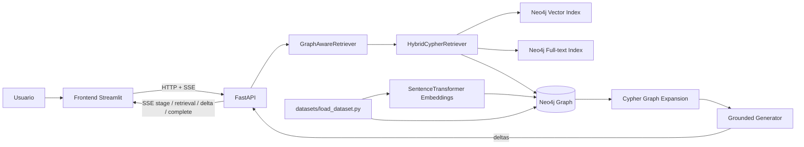
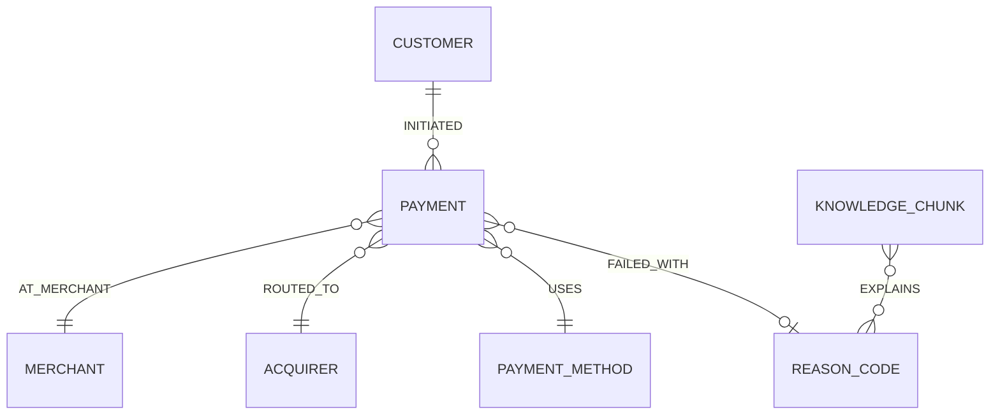

# GraphRAG Payments PoC


PoC para demostrar una arquitectura **GraphRAG (Graph Retrieval-Augmented Generation)** sobre un caso funcional de 
**payment processing**: investigación de rechazos, timeouts y controles operativos de pagos.

El foco no es construir un procesador de pagos completo. El objetivo es probar, de extremo a extremo, que una consulta en lenguaje natural puede:

1. recuperar conocimiento por similitud semántica;
2. combinar esa recuperación con búsqueda lexical;
3. usar el resultado como punto de entrada a un **grafo de conocimiento**;
4. recorrer relaciones para incorporar pagos, códigos de rechazo, comercios y adquirentes conectados;
5. generar una respuesta sustentada en ese contexto y exponer trazabilidad de lo recuperado.

---

## 1. Caso de uso tecnológico

Un RAG vectorial tradicional puede encontrar un texto que explique el código `05`, pero no conoce por sí mismo qué pagos de la muestra están conectados con ese código, en qué comercio ocurrieron o por qué adquirente fueron ruteados.

GraphRAG agrega esa segunda dimensión: después de encontrar los `KnowledgeChunk` relevantes, la consulta recorre el grafo:

`KnowledgeChunk -> ReasonCode <- Payment -> Merchant / Acquirer`

La PoC usa `HybridCypherRetriever` del paquete oficial `neo4j-graphrag` para combinar:

- **vector retrieval** sobre embeddings multilingües;
- **full-text retrieval** para coincidencias lexicales como `05`, `91`, `3DS`, etc.;
- **Cypher graph expansion** para recuperar entidades relacionadas;
- **exact entity anchoring** para códigos explícitos: una pregunta por `código 91` ancla primero el `ReasonCode 91` antes de completar el contexto con el ranking híbrido.

La documentación oficial de Neo4j describe `HybridCypherRetriever` precisamente como un retriever que busca por vector + full-text y luego ejecuta una consulta Cypher para recorrer más contexto del grafo.

---

## 2. Caso de uso funcional: investigación de payment processing

El dataset ampliado simula **24 pagos**, **5 comercios**, **2 adquirentes** y **15 chunks de conocimiento**. Incluye aprobaciones, rechazos, fallas técnicas, controles antifraude y estados operativos como:

- `05`: do not honor;
- `51`: fondos insuficientes;
- `91`: emisor/switch no disponible;
- `3DS_TIMEOUT`: timeout durante autenticación;
- `DUPLICATE_RISK`: riesgo de duplicidad por retry sin idempotencia;
- `54`, `57`, `61`, `96`: expiración, operación no permitida, límite de monto y falla técnica;
- `FRAUD_VELOCITY`: bloqueo por reglas de velocity;
- `CAPTURE_FAILED`: captura fallida luego de autorización;
- `WEBHOOK_DELAY`: evento tardío / consistencia eventual;
- `REFUND_PENDING`: reembolso pendiente;
- `TOKENIZATION_ERROR`: falla de tokenización.

Ejemplo de pregunta:

```text
¿Por qué se rechazan pagos con código 05 y qué debería revisar operaciones?
```

La PoC recupera el conocimiento que explica el código y expande el grafo hacia los pagos conectados, mostrando comercio, adquirente, monto y estado como evidencia adicional.

---

## 3. Arquitectura



---

## 4. Estructura del proyecto

```text
.
├── datasets/                  # Datos de ejemplo y cargador idempotente del grafo
│   ├── data/
│   └── load_dataset.py
├── frontend/                  # UI conversacional Streamlit estilo ChatGPT con identidad visual Axiz
│   ├── .streamlit/config.toml  # Tema oscuro y tokens visuales de Streamlit
│   ├── assets/                 # Logo, ícono del agente y favicon del frontend de referencia
│   ├── api_client.py
│   ├── ui_helpers.py
│   └── app.py
├── infrastructure/            # Docker Compose, Dockerfiles y ejemplos request/response
│   ├── requests/
│   ├── responses/
│   ├── app.Dockerfile          # Imagen backend compartida por API y dataset-loader
│   ├── frontend.Dockerfile
│   └── docker-compose.yml
├── src/pe/axiz/graphrag_payments/
│   ├── api/                   # Endpoints FastAPI
│   ├── application/           # Retrieval, generación y orquestación GraphRAG
│   ├── domain/                # Contratos Pydantic
│   ├── infrastructure/        # Acceso a Neo4j
│   ├── main.py
│   └── settings.py
├── tests/                     # Pruebas unitarias
├── pyproject.toml
└── README.md                  # Único documento del proyecto
```

---

## 5. Código principal

### `application/retrieval.py`

Implementa el núcleo tecnológico. Usa `SentenceTransformerEmbeddings` y `HybridCypherRetriever`. El retriever identifica `KnowledgeChunk` relevantes y luego ejecuta una expansión Cypher. Cuando la pregunta contiene un código explícito (`código 91`, por ejemplo), primero ejecuta un **anclaje exacto por entidad** sobre `ReasonCode` para impedir que la similitud semántica sustituya el código consultado por otro cercano. Después completa los resultados con `HybridCypherRetriever`. La expansión agrega:

- `ReasonCode` explicados por el chunk;
- `Payment` que fallaron con esos códigos;
- `Merchant` de esos pagos;
- `Acquirer` por el que fueron ruteados.

### `application/generation.py`

Abstrae la etapa de generación:

- `DeterministicGroundedGenerator`: modo por defecto, reproducible y sin API key;
- `OpenAIGroundedGenerator`: opcional, usa un LLM y recibe exactamente el mismo contexto GraphRAG.

### `application/service.py`

Orquesta retrieval + generación y expone metadatos de trazabilidad. También permite consultar el subgrafo de un pago específico.

### `datasets/load_dataset.py`

Es el único mecanismo de inicialización de datos/esquema. Es idempotente y crea:

- constraints;
- índice vectorial;
- índice full-text;
- conocimiento operativo con embeddings;
- pagos y relaciones.

---

## 6. Tecnologías y versiones

La PoC apunta a **Python 3.13**. Las dependencias directas se fijan para hacer la ejecución reproducible y fueron seleccionadas sobre versiones estables actuales al 18-09-2026:

| Tecnología | Versión |
|---|---:|
| Python | 3.13 |
| Neo4j Community | 2026.08.1 |
| neo4j-graphrag | 1.19.0 |
| neo4j Python driver | 6.3.1 |
| sentence-transformers | 3.4.1 (última versión compatible con GraphRAG 1.19.0) |
| FastAPI | 0.141.1 |
| Uvicorn | 0.53.0 |
| Pydantic | 2.13.5 |
| pydantic-settings | 2.15.0 |
| OpenAI Python SDK | 1.109.1 (última versión compatible con GraphRAG 1.19.0) |
| Streamlit | 1.64.0 |
| HTTPX | 0.28.1 |
| pytest | 9.1.1 |
| Ruff | 0.16.8 |

`neo4j-graphrag 1.19.0` soporta Python 3.13 y declara `neo4j >=5.28.4,<7`, `pydantic >=2.6.3,<3`, `sentence-transformers >=3,<4` y `openai >=1.51.1,<2`. Por eso se usan `sentence-transformers 3.4.1` y `openai 1.109.1`: son las últimas versiones de sus respectivas ramas que permanecen dentro de los rangos soportados por GraphRAG 1.19.0. No se usan las versiones absolutas más nuevas 6.x/3.x porque romperían la resolución de dependencias.

---

## 7. Modelo de grafo



El índice vectorial y full-text se aplican a `KnowledgeChunk`; la evidencia transaccional se obtiene navegando relaciones, 
no duplicándola dentro del texto embebido.

---

## 8. Endpoints en orden de ejecución

| Orden | Método | Endpoint | Descripción funcional | Descripción técnica |
|---:|---|---|---|---|
| 1 | GET | `/health/live` | Verifica que el proceso API esté vivo | No toca dependencias externas |
| 2 | GET | `/health/ready` | Verifica que el servicio esté listo | Ejecuta una consulta mínima a Neo4j |
| 3 | GET | `/api/v1/graph/schema` | Permite inspeccionar el modelo cargado | Devuelve labels, relationship types e índices de Neo4j |
| 4 | GET | `/api/v1/payments/{payment_id}/graph` | Inspecciona el vecindario de un pago | Recupera nodos/relaciones conectados al payment |
| 5 | POST | `/api/v1/graphrag/query` | Responde una pregunta operativa de forma síncrona | Hybrid retrieval + graph expansion + grounded generation |
| 6 | POST | `/api/v1/graphrag/query/stream` | Responde progresivamente para la UI | SSE: `stage` → `retrieval` → `delta` → `complete` |

Swagger/OpenAPI queda disponible en `http://localhost:8000/docs`.

---

## 9. Levantar infraestructura y aplicación

### Prerrequisitos

- Docker Desktop / Docker Engine con Docker Compose v2.
- Aproximadamente 2–3 GB libres para imágenes, dependencias ML CPU y modelo de embeddings.
- La primera ejecución necesita acceso a Internet para descargar la imagen de Neo4j, dependencias Python y el modelo de Sentence Transformers.
- Para ejecución local fuera de Docker se recomienda `uv`; Docker Compose no lo requiere.

Desde la raíz del proyecto:

```bash
cp .env.example .env
```

Luego:

```bash
docker compose -f infrastructure/docker-compose.yml up --build
```
El flujo de arranque es secuencial:

1. `neo4j` inicia;
2. `dataset-loader` espera a Neo4j, crea constraints/índices y carga datos + embeddings;
3. `api` inicia cuando el dataset terminó correctamente;
4. `frontend` inicia cuando la API está saludable.


### 9.1 Qué esperar del primer build

La primera ejecución es la más costosa porque debe descargar las imágenes base y las dependencias ML. Para ver el detalle del progreso:

```bash
docker compose -f infrastructure/docker-compose.yml build --progress=plain
```

Luego levante los servicios sin reconstruir:

```bash
docker compose -f infrastructure/docker-compose.yml up
```

Para comprobar que Docker está reutilizando caché en una reconstrucción, las etapas de instalación de PyTorch/dependencias deberían aparecer como `CACHED` mientras `pyproject.toml` permanezca sin cambios.

Servicios:

- Frontend: `http://localhost:8501`
- API: `http://localhost:8000`
- Swagger: `http://localhost:8000/docs`
- Neo4j Browser: `http://localhost:7474`

Credenciales Neo4j por defecto:

```text
usuario: neo4j
password: axiz-graphrag-poc
```

Para detener:

```bash
docker compose -f infrastructure/docker-compose.yml down
```

Para detener y borrar el volumen Neo4j:

```bash
docker compose -f infrastructure/docker-compose.yml down -v
```

---

## 10. Carga del dataset

Normalmente no hay que ejecutar nada manual: `dataset-loader` se ejecuta automáticamente por Compose.

Si se quiere recargar manualmente desde el host, con Neo4j ya levantado:

```bash
uv sync --extra dev --extra ui
uv run python datasets/load_dataset.py
```

El script es idempotente: usa `MERGE` para nodos/relaciones y `CREATE ... IF NOT EXISTS` para schema/indexes. Si se actualiza desde una versión anterior con un dataset diferente, vuelva a ejecutar el `dataset-loader` para sincronizar nodos y embeddings.

Archivos precargados:

- `datasets/data/knowledge.json`: conocimiento operacional usado para retrieval;
- `datasets/data/payments.json`: pagos, comercios, adquirentes, métodos y códigos relacionados.

---

## 11. Ejecutar el proyecto sin Docker para API/frontend

Puede usarse Neo4j en Docker y ejecutar API/UI desde el IDE.

### 11.1 Dependencias

```bash
uv sync --extra dev --extra ui
```

### 11.2 Neo4j

```bash
docker compose -f infrastructure/docker-compose.yml up -d neo4j
```

### 11.3 Variables locales

En el host, ajuste `.env` para apuntar a:

```dotenv
NEO4J_URI=neo4j://localhost:7687
```

### 11.4 Dataset

```bash
uv run python datasets/load_dataset.py
```

### 11.5 API

```bash
uv run uvicorn pe.axiz.graphrag_payments.main:app --reload --port 8000
```

### 11.6 Frontend

En otra terminal:

```bash
cd frontend
API_BASE_URL=http://localhost:8000 uv run streamlit run app.py
```

---

## 12. Probar por `curl`

### Test 1 — liveness

Comprueba que FastAPI está ejecutándose; no valida Neo4j.

```bash
curl -s http://localhost:8000/health/live
```

Esperado:

```json
{"status":"ok"}
```

### Test 2 — readiness

Comprueba que la API realmente puede consultar Neo4j.

```bash
curl -s http://localhost:8000/health/ready
```

Esperado cuando OpenAI está activo:

```json
{"status":"ready","neo4j":"reachable","generation_provider":"openai","generation_model":"gpt-5-mini","openai_key_configured":true}
```

Este endpoint permite verificar la configuración del **API activo**, no la de un contenedor temporal.

### Test 3 — inspeccionar el schema del grafo

Permite validar que el dataset-loader creó labels, relaciones e índices.

```bash
curl -s http://localhost:8000/api/v1/graph/schema
```

Debe incluir, entre otros, `Payment`, `KnowledgeChunk`, `ReasonCode`, `knowledge_embedding` y `knowledge_fulltext`.

### Test 4 — ver el subgrafo de un pago

Valida relaciones reales alrededor de una transacción fallida.

```bash
curl -s http://localhost:8000/api/v1/payments/PAY-1003/graph
```

Debe recuperar el `Payment` y sus vecinos: customer, merchant, acquirer, method y reason code.

### Test 5 — GraphRAG por código de rechazo

Este es el test principal. Demuestra búsqueda semántica + lexical + expansión de grafo.

```bash
curl -s -X POST http://localhost:8000/api/v1/graphrag/query \
  -H 'Content-Type: application/json' \
  -d @infrastructure/requests/01-graphrag-query.json
```

Revise en la respuesta:

- `answer`: respuesta sustentada;
- `contexts`: chunks recuperados;
- `reason_codes`: entidades conectadas;
- `related_payments`: evidencia transaccional obtenida recorriendo el grafo;
- `trace.retriever`: debe ser `HybridCypherRetriever`;
- `trace.graph_expansion`: muestra el recorrido aplicado.

Para validar el anclaje exacto por código:

```bash
curl -s -X POST http://localhost:8000/api/v1/graphrag/query \
  -H 'Content-Type: application/json' \
  -d '{"question":"¿Para qué sirve el código 91?","top_k":4,"include_context":true}'
```

El primer contexto debe corresponder al código `91`; en `trace.retrieval_strategy` debe aparecer `exact_reason_code_anchor+hybrid` y `trace.explicit_reason_codes` debe contener `91`.

### Test 6 — consulta semántica sin citar un código

Demuestra que el retrieval no depende únicamente de keywords exactas.

```bash
curl -s -X POST http://localhost:8000/api/v1/graphrag/query \
  -H 'Content-Type: application/json' \
  -d '{
    "question":"Veo fallas temporales de conectividad con el emisor. ¿Qué debería correlacionar y qué pagos de ejemplo existen?",
    "top_k":4,
    "include_context":true
  }'
```

Se espera recuperar conocimiento asociado a indisponibilidad (`91`) y/o ruteo/latencia, junto con pagos relacionados por el grafo.

### Otras preguntas útiles para probar el corpus

- `¿Qué significa el código 54 y debo reintentar con la misma tarjeta?`
- `¿Qué diferencia hay entre fondos insuficientes (51) y exceder el límite (61)?`
- `¿Qué debería revisar si recibo código 96 en una ventana de pocos minutos?`
- `¿Por qué una autorización aprobada puede terminar con captura fallida?`
- `¿Cómo debería tratar webhooks tardíos sin crear un segundo pago?`
- `¿Qué evidencia hay de reglas de velocity o antifraude?`
- `¿Qué debo revisar ante errores de tokenización?`
- `¿Cómo manejar un reembolso que sigue pendiente?`
- `¿Cuándo tiene sentido hacer rerouting por adquirente?`
- `¿Qué diferencia hay entre un timeout 3DS y un código 91 del emisor?`

---

## 13. Activar generación con OpenAI

El modo por defecto es totalmente local/reproducible:

```dotenv
GENERATION_PROVIDER=deterministic
```

Para usar un LLM:

```dotenv
GENERATION_PROVIDER=openai
OPENAI_API_KEY=<su-api-key>
OPENAI_MODEL=gpt-5-mini
```

Después de modificar `.env`, **recree `api`**; `docker compose restart api` no cambia las variables con las que fue creado el contenedor:

```bash
docker compose --env-file .env -f infrastructure/docker-compose.yml up -d --no-deps --force-recreate api
```

Verifique el contenedor real que atiende tráfico:

```bash
docker compose -f infrastructure/docker-compose.yml exec api \
  python -c "import os; print(os.getenv('GENERATION_PROVIDER')); print(os.getenv('OPENAI_MODEL')); print(bool(os.getenv('OPENAI_API_KEY')))"
```

---

## 14. Calidad de código y pruebas

Instalar entorno de desarrollo:

```bash
uv sync --extra dev --extra ui
```

Lint:

```bash
uv run ruff check src frontend datasets tests
```

Tests:

```bash
uv run pytest -q
```

Compilación sintáctica de todo el código Python:

```bash
uv run python -m compileall -q src frontend datasets tests
```

Build del paquete:

```bash
uv build
```